# Rick and Morty Flutter App

A Flutter application that displays characters, episodes, locations, and more from the Rick and Morty universe using the [Rick and Morty API](https://rickandmortyapi.com/).

## ✨ Features

- View all characters, locations, and episodes
- Load characters of a specific episode
- Load residents of a location
- Infinite scroll for episode list
- Light/Dark theme toggle
- Clean MVVM architecture with Provider

## 📦 Technologies Used

- **[Flutter](https://flutter.dev/)** – UI Toolkit
- **[Provider](https://pub.dev/packages/provider)** – State Management
- **[Dio](https://pub.dev/packages/dio)** – Networking
- **[GoRouter](https://pub.dev/packages/go_router)** – Navigation
- **[GetIt](https://pub.dev/packages/get_it)** – Dependency Injection
- **[SharedPreferences](https://pub.dev/packages/shared_preferences)** – Local Storage
  
## 🖼️ Screenshots

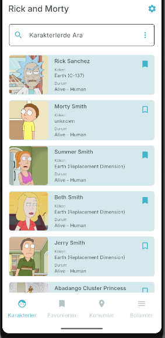
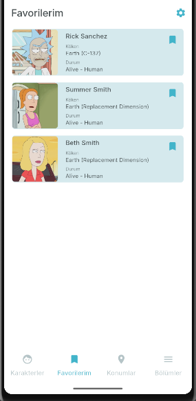
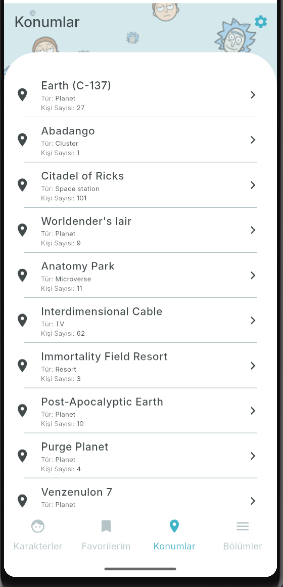
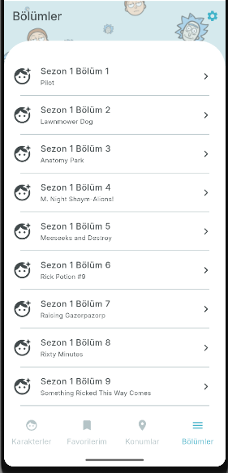
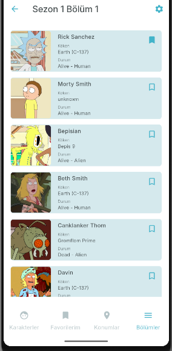
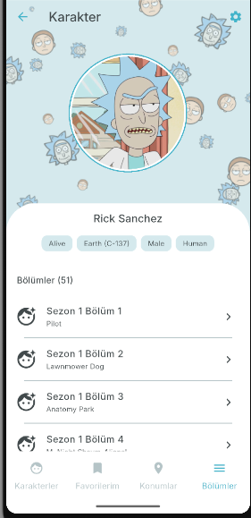
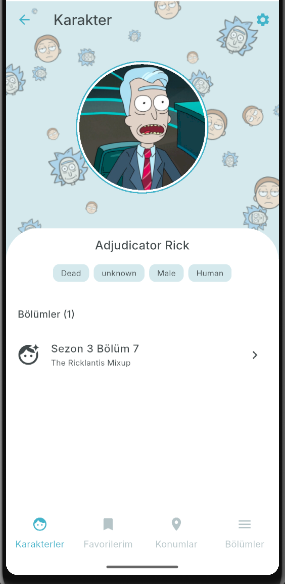
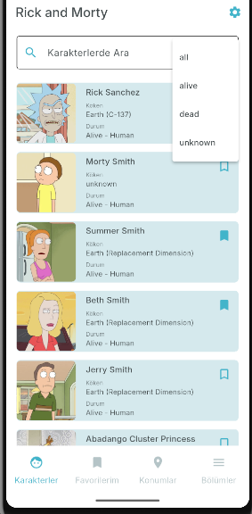
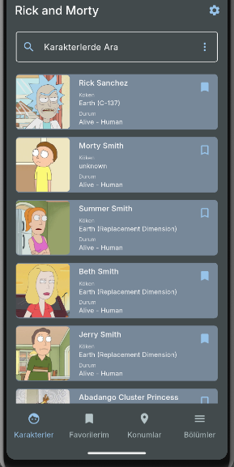
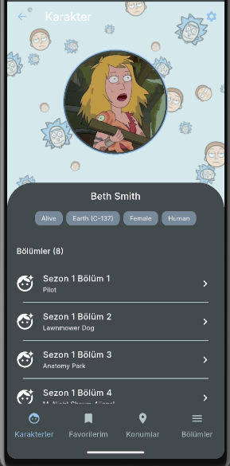
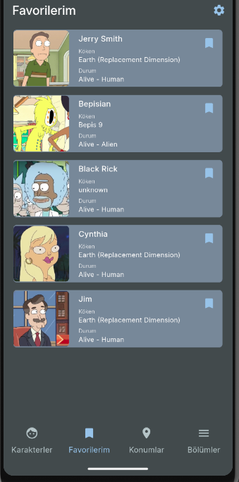
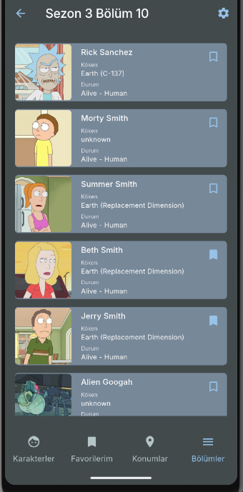

## 🚀 Getting Started

#### Clone the repository

```markdown
git clone https://github.com/gulistansenates/flutter-rick-and-morty-app.git
cd rick_and_morty_app
```
#### Install dependencies

```markdown
flutter pub get
```
#### Run the app 

```markdown
flutter run
```
## License

[MIT](https://choosealicense.com/licenses/mit/)
